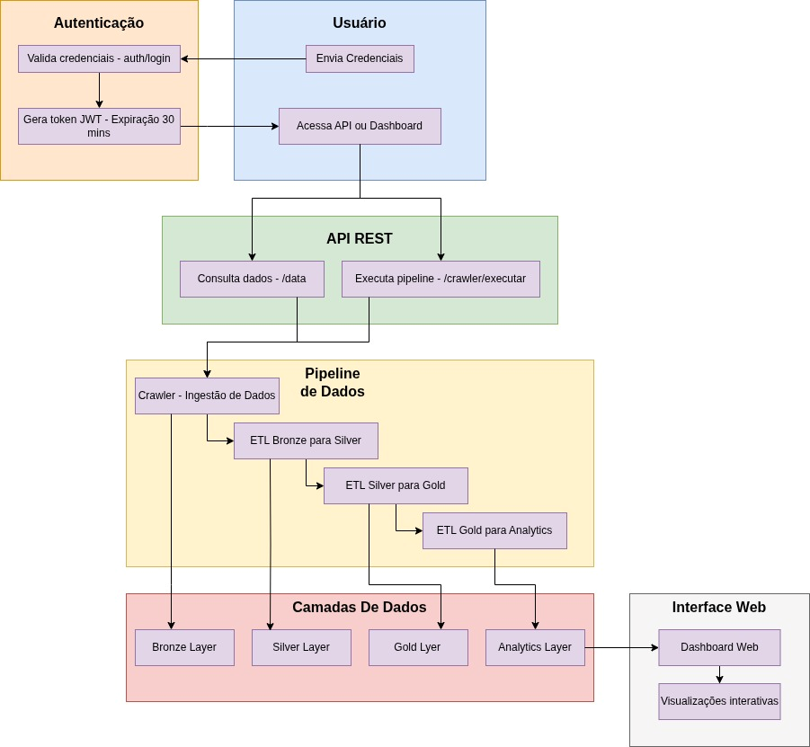

# 🍇 Tech Challenge FIAP - API para Dados Vitivinícolas


Uma API REST completa para coleta, processamento e disponibilização de dados vitivinícolas da Embrapa, com pipeline ETL automatizado e dashboard de visualização.

## 📋 Índice

- [Visão Geral](#-visão-geral)
- [Arquitetura](#-arquitetura)
- [Funcionalidades](#-funcionalidades)
- [Configuração e Instalação](#-configuração-e-instalação)
- [Executando o Projeto](#-executando-o-projeto)
- [API Endpoints](#-api-endpoints)
- [Dashboard](#-dashboard)
- [Pipeline de Dados](#-pipeline-de-dados)
- [Estrutura do Projeto](#-estrutura-do-projeto)
- [Cenários de Uso com Machine Learning](#-cenários-de-uso-com-machine-learning)
- [Contribuição](#-contribuição)
- [Licença](#-licença)

## 🔍 Visão Geral

Este projeto é uma solução completa para coleta, processamento e disponibilização de dados vitivinícolas da Embrapa. A arquitetura inclui:

- **API REST** com autenticação JWT
- **Crawler** automatizado para coleta de dados
- **Pipeline ETL** com camadas Bronze, Silver e Gold
- **Dashboard** interativo para visualização de dados
- **Documentação Swagger** para facilitar o uso da API

Os dados coletados incluem informações sobre produção, processamento, comercialização, importação e exportação de uvas, vinhos e derivados no Brasil.

## 🏗️ Arquitetura

O sistema segue uma arquitetura moderna de processamento de dados:



1. **Camada de Coleta (Crawler)**: Extrai dados do site da Embrapa
2. **Camada de Processamento (ETL)**:
   - **Bronze**: Dados brutos como coletados
   - **Silver**: Dados limpos e padronizados
   - **Gold**: Dados curados e prontos para análise
   - **Analytics**: Dados agregados para visualização
3. **Camada de Exposição**:
   - **API REST**: Endpoints para consumo dos dados
   - **Dashboard**: Interface visual para análise

## ⚙️ Funcionalidades

### 🔐 Autenticação

- Sistema de autenticação JWT para proteção dos endpoints
- Tokens com validade de 30 minutos
- Login simplificado para o dashboard

### 🕷️ Crawler Automatizado

- Coleta dados diretamente do site da Embrapa
- Verifica disponibilidade dos links antes de iniciar o download
- Sistema de logs para monitoramento do processo

### 🔄 Pipeline ETL

- Processamento completo dos dados em três camadas
- Transformações específicas para cada tipo de dado
- Geração de datasets analíticos para visualização

### 📊 Dashboard Interativo

- Visualização dos dados por categoria
- Filtros dinâmicos por ano, país, categoria, etc.
- Gráficos interativos para análise de tendências
- **Botão de atualização de dados** que executa o crawler e os pipelines ETL em tempo real
- Feedback visual sobre o status da atualização, incluindo mensagem de erro caso o site da Embrapa esteja indisponível

### 📡 API REST

- Endpoints para consulta de dados por categoria e subcategoria
- Documentação Swagger integrada
- Execução automática do pipeline a cada consulta (para fins de demonstração)

## 🛠️ Configuração e Instalação

### Pré-requisitos

- Python 3.8 ou superior
- pip (gerenciador de pacotes Python)
- Git

### 1. Clonar o Repositório

```bash
git clone https://github.com/seu-usuario/tech-challenge-fiap-machine-learning-api.git
cd tech-challenge-fiap-machine-learning-api
```

### 2. Criar e Ativar Ambiente Virtual

#### Windows

```bash
python -m venv venv
venv\Scripts\activate
```

#### Linux/Mac

```bash
python -m venv venv
source venv/bin/activate
```

### 3. Instalar Dependências

```bash
pip install -r requirements.txt
```

### 4. Configuração de Variáveis de Ambiente (Opcional)

O projeto está configurado para funcionar com valores padrão, mas você pode personalizar as chaves de segurança criando um arquivo `.env` na raiz do projeto:

```
JWT_SECRET_KEY=sua_chave_secreta_para_jwt
FLASK_SECRET_KEY=sua_chave_secreta_para_flask_session
```

Se não for criado, o sistema usará chaves padrão definidas no código.

## 🚀 Executando o Projeto

### Iniciar a API e o Dashboard

```bash
python -m api.app
```

O servidor estará disponível em:

- API: `http://127.0.0.1:5000/data/`
- Dashboard: `http://127.0.0.1:5000/`
- Documentação Swagger: `http://127.0.0.1:5000/apidocs/`

### Autenticação

Entrando no Dashboard será solicitado usuário e senha. Caso não tenha feito a criação do arquivo para as variáveis de ambiente como o indicado, faça a utilização das seguintes credenciais para ter acesso ao dashboard:

User: admin

Password: demonstracao

### Autenticação

POST /auth/login

```
{
  "username": "user",
  "password": "user"
}
```

**Resposta**:

```json
{
  "access_token": "eyJhbGciOiJIUzI1NiIsInR5cCI6IkpXVCJ9..."
}
```

### Executar Crawler Manualmente

```
POST /crawler/executar
```

**Header**:

```
Authorization: Bearer <seu_token>
```

### Consultar Dados

```
GET /data/<categoria>/<subcategoria>
```

**Categorias disponíveis**:

- `exportacao`
- `importacao`
- `processamento`
- `comercializacao`
- `producao`

**Subcategorias por categoria**:


| Categoria       | Subcategorias                             |
| --------------- | ----------------------------------------- |
| exportacao      | espumantes, suco, uva, vinho              |
| importacao      | espumantes, frescas, passas, suco, vinhos |
| processamento   | americanas, mesa, semclass, viniferas     |
| comercializacao | default                                   |
| producao        | default                                   |

**Header**:

```
Authorization: Bearer <seu_token>
```

**Exemplo de resposta**:

```json
{
  "mensagem": "Dados de exportacao/suco carregados com sucesso!",
  "usuario": "user",
  "dados": [
    {"pais": "alemanha", "ano": 1970, "kilograms": 0, "dollars": 0},
    {"pais": "brasil", "ano": 1971, "kilograms": 100, "dollars": 2000}
  ]
}
```

## 🖥️ Dashboard

O dashboard oferece uma interface visual para análise dos dados coletados e processados.

### Acesso

URL: `http://127.0.0.1:5000/`

**Credenciais**:

- Usuário: `admin`
- Senha: `demonstracao`

### Páginas Disponíveis

- **Comercialização**: Dados sobre comercialização de produtos vitivinícolas
- **Exportação**: Dados sobre exportação de vinhos, sucos, uvas e espumantes
- **Importação**: Dados sobre importação de vinhos, sucos, uvas frescas, passas e espumantes
- **Processamento**: Dados sobre processamento de uvas por tipo e classificação
- **Produção**: Dados sobre produção de uvas e derivados

Cada página possui filtros dinâmicos baseados nos dados disponíveis, como ano, país, categoria, etc.

### Atualização de Dados em Tempo Real

O dashboard inclui um botão "Atualizar Dados" que permite:

1. Executar o crawler para baixar os dados mais recentes do site da Embrapa
2. Processar automaticamente os dados através do pipeline ETL completo:
   - Bronze Layer: Armazenamento dos dados brutos
   - Silver Layer: Limpeza e padronização
   - Gold Layer: Curadoria final para análise

Se o site da Embrapa estiver indisponível, o sistema exibirá a mensagem "Site da Embrapa se encontra indisponível no momento" e manterá os dados existentes.

## 📊 Pipeline de Dados

O pipeline de dados segue uma arquitetura de três camadas:

### 1. Bronze Layer (Dados Brutos)

- Dados coletados diretamente do site da Embrapa
- Formato original sem transformações
- Armazenados em `data/bronze-layer/`

### 2. Silver Layer (Dados Limpos)

- Dados com tratamento inicial
- Padronização de formatos e nomes de colunas
- Remoção de inconsistências
- Armazenados em `data/silver-layer/`

### 3. Gold Layer (Dados Curados)

- Dados completamente processados
- Enriquecidos com informações adicionais
- Prontos para análise e visualização
- Armazenados em `data/gold-layer/`

### 4. Analytics Layer (Dados Agregados)

- Dados agregados para visualização no dashboard
- Otimizados para consultas rápidas
- Armazenados em `data/analytics/`

## 📁 Estrutura do Projeto

```
tech-challenge-fiap-machine-learning-api/
├── api/                           # API REST
│   ├── app.py                     # Configuração da API
│   └── routes/                    # Rotas da API
│       ├── auth_routes.py         # Autenticação
│       ├── crawler_routes.py      # Execução do crawler
│       └── data_routes.py         # Consulta de dados
│
├── crawler/                       # Módulo de coleta de dados
│   ├── logs/                      # Logs do crawler
│   ├── scraper/                   # Scripts de coleta
│   │   ├── __init__.py
│   │   └── downloader.py          # Download dos dados
│   ├── __init__.py
│   ├── config.py                  # Configurações do crawler
│   ├── main.py                    # Ponto de entrada
│   └── README.MD                  # Documentação do crawler
│
├── dashboard/                     # Interface visual
│   ├── static/                    # Arquivos estáticos
│   │   ├── css/                   # Estilos
│   │   └── js/                    # Scripts
│   ├── templates/                  # Templates HTML
│   ├── __init__.py
│   ├── auth_config.py             # Configuração de autenticação
│   └── routes.py                  # Rotas do dashboard
│
├── data/                          # Armazenamento de dados
│   ├── analytics/                 # Dados para visualização
│   ├── bronze-layer/              # Dados brutos
│   ├── silver-layer/              # Dados limpos
│   └── gold-layer/                # Dados curados
│
├── pipelines/                     # Pipelines ETL
│   └── etl/
│       ├── bronze_to_silver/      # Transformação Bronze → Silver
│       ├── silver_to_gold/        # Transformação Silver → Gold
│       └── gold_to_analytics/     # Transformação Gold → Analytics
│
├── .gitignore                     # Arquivos ignorados pelo Git
├── app.py                         # Ponto de entrada principal
├── LICENSE                        # Licença do projeto
├── Procfile                       # Configuração para deploy
├── README.md                      # Este arquivo
└── requirements.txt               # Dependências do projeto
```

## 🧠 Cenários de Uso com Machine Learning

Esta API foi projetada para alimentar modelos de machine learning para análise e previsão de dados vitivinícolas. Alguns cenários possíveis:

### Previsão de Produção

- Modelos de séries temporais para prever a produção de uvas por tipo
- Análise de fatores climáticos e seu impacto na produção

### Análise de Mercado

- Previsão de tendências de exportação e importação
- Identificação de mercados emergentes para vinhos brasileiros

### Otimização de Processamento

- Modelos para otimizar o processamento de diferentes tipos de uva
- Previsão de demanda para ajuste de capacidade produtiva

### Análise de Preços

- Modelos para prever flutuações de preços no mercado internacional
- Identificação de fatores que influenciam os preços de exportação

**Nota**: Em um ambiente de produção, o pipeline seria executado por agendamento (usando ferramentas como Airflow, Jenkins ou cron), e não a cada consulta como implementado neste MVP.

# 

Desenvolvido como parte do Tech Challenge da FIAP - Pós-Graduação em Machine Learning Engineering.
